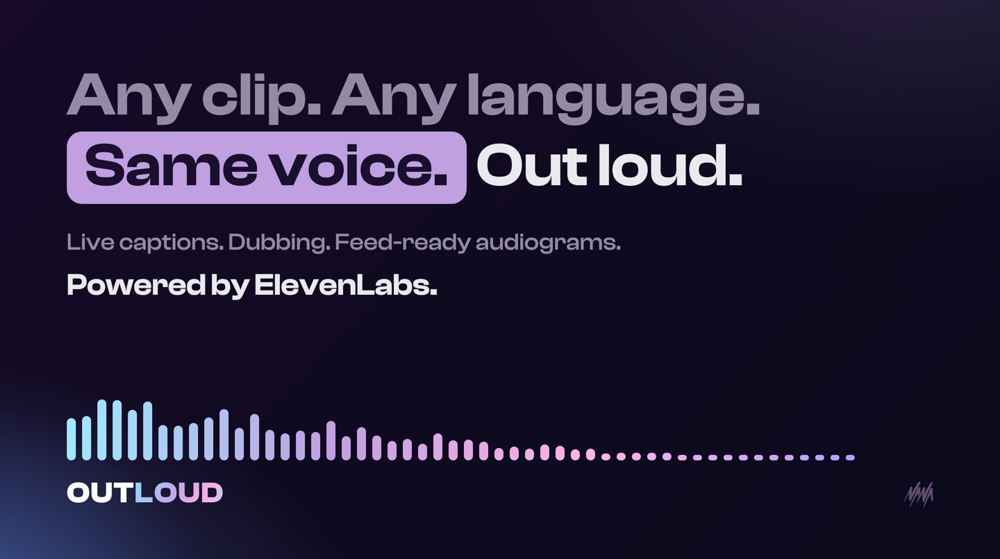

# OutLoud

**Any clip. Any language. Same voice.**

OutLoud turns any audio or video clip into a live-captioned audiogram that keeps the speaker's original voice, intonation, and expression. Dub it into 19 languages in that same voice, or write a script and have an expressive AI voice perform it. Built on ElevenLabs and rendered entirely in the browser.

**Live:** [outloud.nana.works](https://outloud.nana.works)



## Features

- **Caption a clip.** Speech-to-text with true word-level timestamps drives karaoke-style captions, synced to the original audio.
- **Dub a clip.** Translate and re-voice a clip through the ElevenLabs Dubbing API. The output speaks another language in the original speaker's voice, with translated captions.
- **Write a script.** Eleven v3 narration with inline expression tags like `[whispers]` and `[laughs]`, inserted from a tag palette at the cursor.
- **Trim.** A waveform trim tool (keep-selection handles, numeric times, selection preview) so only the part you want is transcribed.
- **Caption editor.** Fix wording or line breaks after generation. Edits are re-aligned to the original word timings with a longest-common-subsequence remap, so sync survives.
- **Design system.** Two canvas layouts, themes, background art, creator handle and photo, with a live preview that is also the editor (click the canvas to edit what you see).
- **Export.** MP4 video (canvas capture piped through MediaRecorder with a screen wake lock), MP3 audio, and SRT or VTT caption files that drop straight into Final Cut or YouTube.

## Architecture

The entire client is one HTML file. No framework, no build step, no bundler.

```
index.html        the app: UI, canvas renderer, audio graph, exports
api/eleven.js     serverless proxy for beta testers
api/feedback.js   feedback form to email
vercel.json       rewrites and headers
```

Notes on the interesting parts:

- **Canvas renderer.** The audiogram is drawn frame-by-frame on a single canvas: karaoke word band with liquid fade and blur edges, animated waveform, layout-aware creator header. The same paint path serves the live preview, playback, and video export, so what you see is exactly what renders.
- **Video export.** Canvas frames are captured with `captureStream` and driven by a Web Worker timer so rendering survives background tabs. A screen wake lock keeps mobile exports from freezing when the display would otherwise sleep.
- **Tester proxy.** The serverless proxy holds the ElevenLabs key server-side behind a shared tester password, forwards only an allowlist of endpoints, rate-limits spend, translates credit-cap errors into honest messages, and logs anonymous usage metadata (feature, language, country) for product analytics. Bring-your-own-key mode talks to ElevenLabs directly and skips the proxy entirely.
- **Trim and compression.** Clips are decoded in the browser and re-rendered to compact mono WAV through an `OfflineAudioContext`, optionally slicing just the trimmed selection, sized to fit serverless body limits.

## Privacy

No accounts, no analytics scripts, no tracking cookies. Your API key is stored in your browser and sent only to ElevenLabs. Audio is processed by ElevenLabs; the proxy stores metadata only, never content. The full data-handling note is in the app footer.

## Roadmap

The living roadmap is in the app: tap the Beta chip on [outloud.nana.works](https://outloud.nana.works). Highlights: accounts and credits, voice cloning for scripts, chapters with timed visuals, and API plus agent access (early-access list is open).

## License

MIT. The OutLoud name, logo, and branding are not covered by the license.
